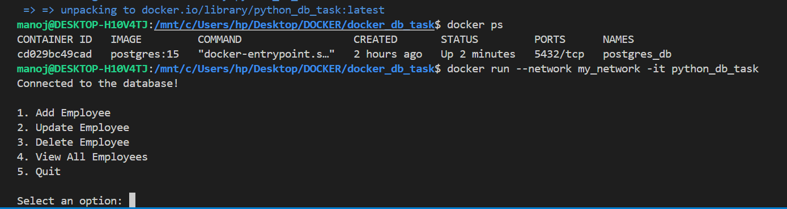
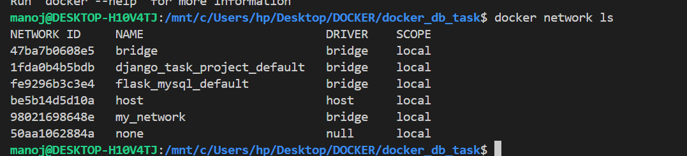
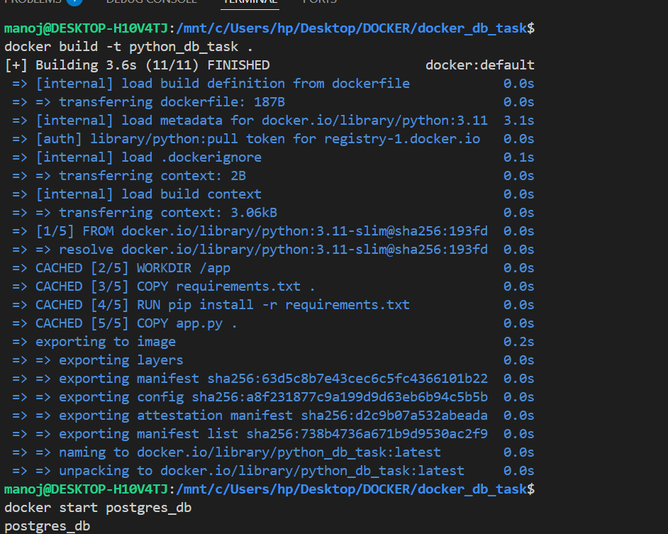
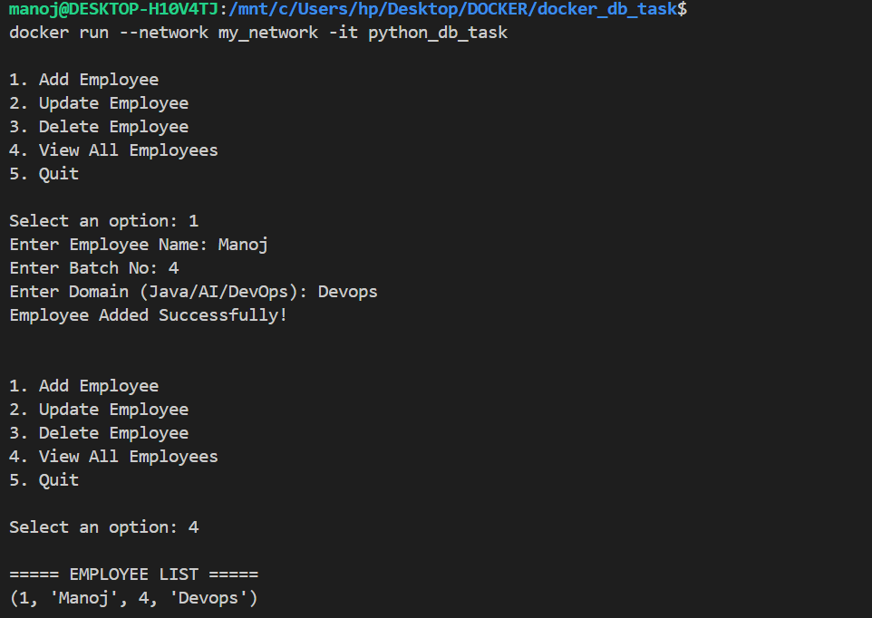
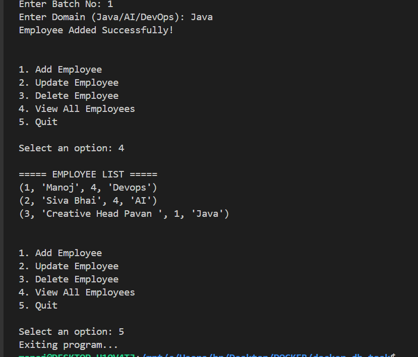
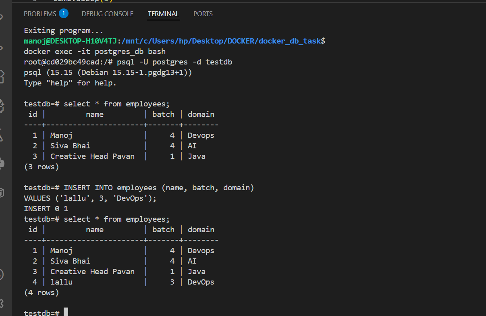

 # Dockerized Python + PostgreSQL Employee CRUD App

This project is a **beginner-level Docker task** that demonstrates how to run a Python app and PostgreSQL inside Docker containers using a **custom Docker network**.

The app connects to PostgreSQL, prints:

```
Connected to the database!
```

and then provides a CRUD menu for managing employees.


 
---


###  What This App Does

* **Connects to PostgreSQL container**
* **Prints "Connected to the database!" when connection succeeds**
* **Creates an `employees` table if not exists**
* **Inserts new employees**
* **Updates existing employees**
* **Deletes employees**
* **Displays all employees**
* **Runs fully inside Docker**

---


##  **Project Structure**

```
docker_db_task/
├── app.py
├── requirements.txt
└── Dockerfile
```

---

##  **Python App (`app.py`)**

The app connects to PostgreSQL and prints:

```
Connected to the database!
```

###  **Key Part — Correct Connection Function**

```python
def get_connection():
    conn = psycopg2.connect(
        host="postgres_db",
        database="testdb",
        user="postgres",
        password="password"
    )
    print("Connected to the database!")
    return conn
```

###  **Full CRUD Application Code**

    app.py — This Python script contains the complete logic for connecting to PostgreSQL, printing the “Connected to the database!” message . 
    It creates the employees table, and performing all CRUD operations (Add, Update, Delete, View). 
    It also provides an interactive menu so users can enter data manually inside the Docker container. 

---

##  **requirements.txt**

```
psycopg2-binary
```

We use binary version to avoid compile issues inside Docker.

---

##  **Dockerfile**

```dockerfile
FROM python:3.11-slim

WORKDIR /app

COPY requirements.txt .
RUN pip install --no-cache-dir -r requirements.txt

COPY app.py .

CMD ["python", "app.py"]
```

---

##  **Create Custom Docker Network**

```bash
docker network create my_network
```

This allows containers to communicate by name (DNS).


---

##  **Run PostgreSQL Container**

```bash
docker run -d \
  --name postgres_db \
  --network my_network \
  -e POSTGRES_PASSWORD=password \
  -e POSTGRES_DB=testdb \
  postgres:15
```

**Important:**

* Container name = `postgres_db`
* Python host must be = `"postgres_db"`

---

##  **Build Python App Image**

```bash
docker build -t python_db_task .
```


---

##  **Run Python App (with user input)**

```bash
docker run --network my_network -it python_db_task
```

You should now see:


```
Connected to the database!

1. Add Employee
2. Update Employee
3. Delete Employee
4. View All Employees
5. Quit
```





---

## **Verify Data in PostgreSQL (Optional)**

### Enter container:

```bash
docker exec -it postgres_db bash
```

### Connect to DB:

```bash
psql -U postgres -d testdb
```

### View table:

```sql
SELECT * FROM employees;
```

---


##  **Useful Docker Commands**

Stop a container:

```bash
docker stop postgres_db
```

Remove a container:

```bash
docker rm postgres_db
```

List all containers:

```bash
docker ps -a
```


---

## **Learned things**

*  **How to Dockerize a Python app**
*  **How to run PostgreSQL in Docker**
*  **How to connect two containers using a custom network**
*  **How to perform CRUD operations**
*  **How to debug containers**
*  **How to verify DB connection with a success message**

---


